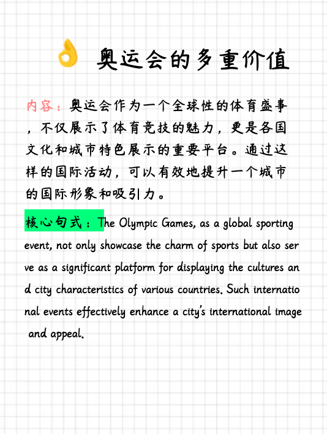
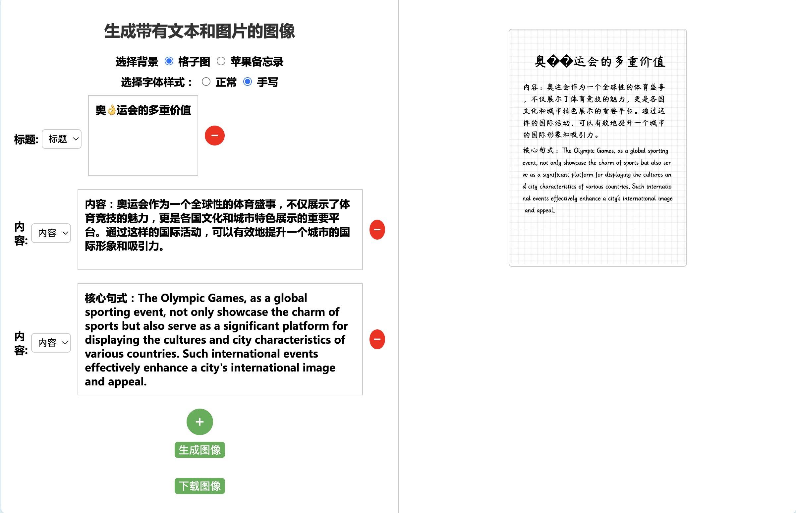
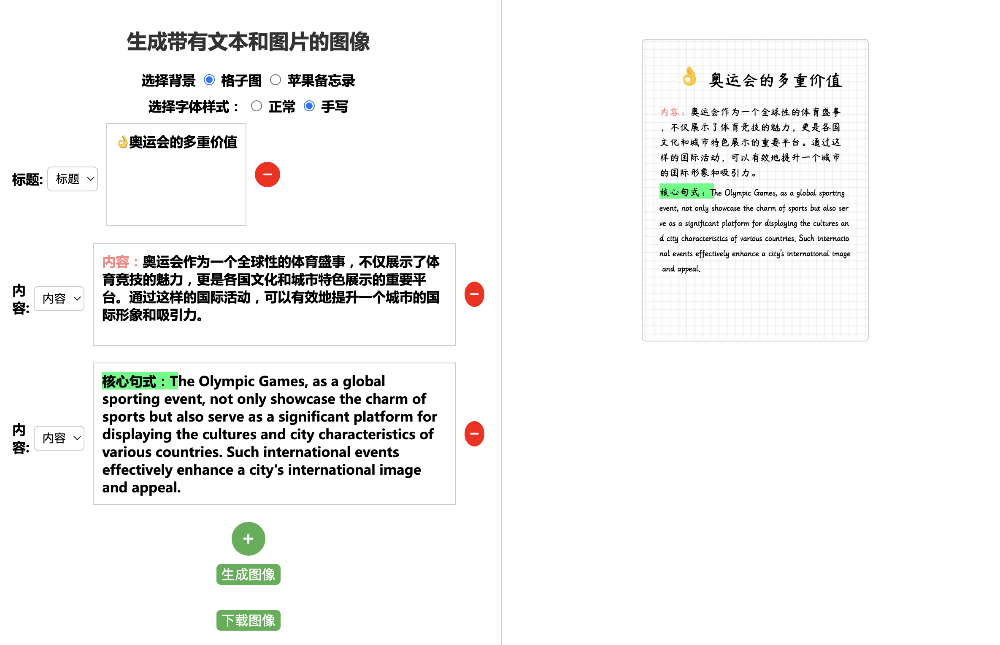

# 📱✨小红书封面生成器

这是一款专为小红书内容创作者设计的自动化工具,旨在简化图文排版过程,提升创作效率。主要功能包括:
🖋 智能文字排版与分页
🎨 文字颜色与背景色自定义
📝 苹果备忘录风格+网格背景
✍️ 中英文手写字体支持
😊 Emoji表情集成(开发中)

我们致力于为创作者提供一个直观、高效的创作平台,让您专注于内容本身,而无需担心繁琐的排版细节。无论您是经验丰富的博主还是刚起步的新手,我们的工具都能帮您轻松制作出精美的小红书图文。

# 直接使用地址
[小红书post自动化](https://xiaohongshu.zhieasy.cn)

# Todo List
```
1. 传入文字自动排版，分页（已完成）
2. 可以给文字添加颜色和背景色（已完成）
3. 苹果备忘录 + 网格的背景（已完成）
4. 手写的中文和英文字体（已完成）
5. emoji 的支持（目前完成了，但是有 bug）
6. 美化 UI
7. 调色盘记录之前的历史颜色，并且有一些默认的颜色
8. 支持自定义的背景图
9. 自定义输入内容，通过智谱-flash 进行自动分行分段以及颜色的渲染
```

# 演示




# 体验迭代群二维码


